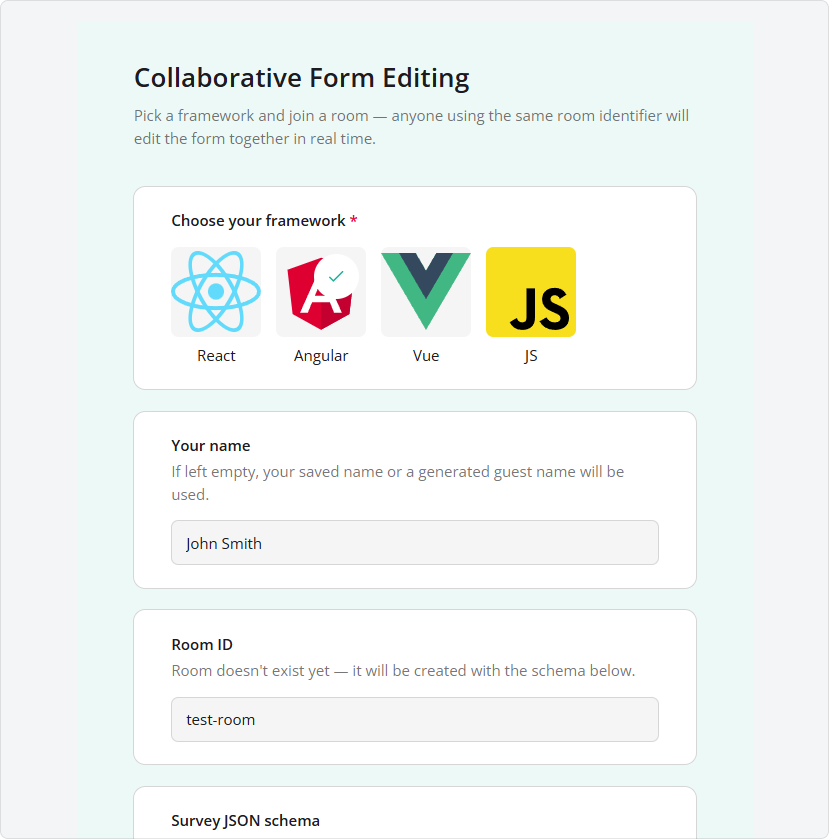
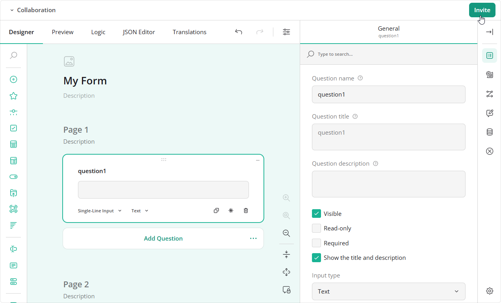
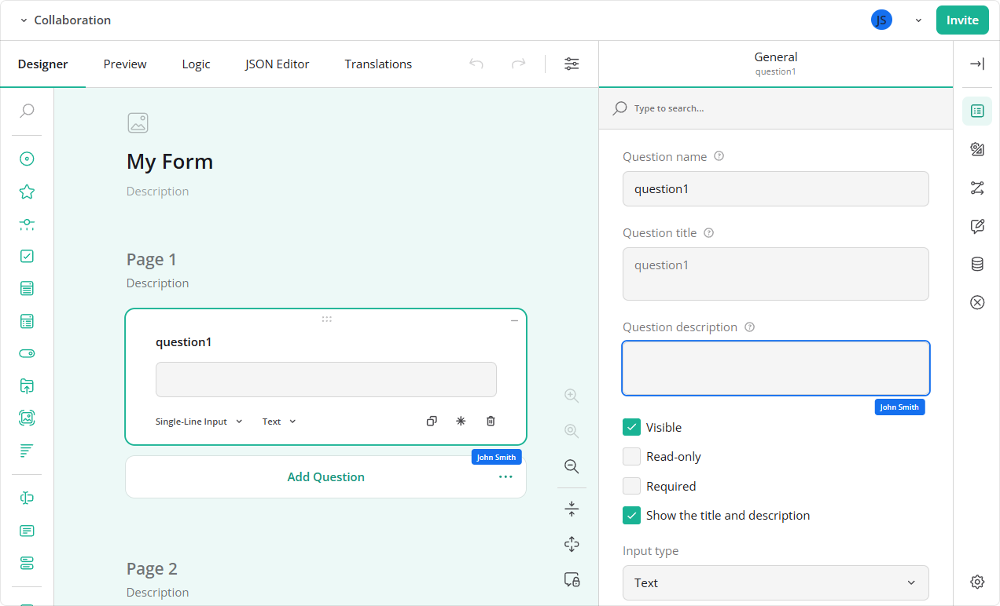

# Collaborative Form Editing by SurveyJS

This app lets several people edit the same form in [SurveyJS Creator](https://surveyjs.io/open-source). Participants can use React, Angular, Vue, or plain JavaScript clients in the same room and see each other's changes in real time.

[Open the Online Demo](https://collaborative-form-editing.demos.surveyjs.io/)

## Try It Locally

Use Node.js 20.11 or later. From the repository root, install the dependencies and start the app:

```bash
npm install
npm start
```

Installation includes the server, lobby, and all four clients. `npm start` builds the lobby and clients, then serves the app at [localhost:8080](http://localhost:8080).

In the lobby, choose a framework and enter a room ID. A new room ID lets you provide the initial survey JSON; an existing ID joins that room. Leave the ID empty to create a random room with an empty survey.



Once you join, click **Invite** to copy a link for another participant. To try collaboration on your own, open the link in a second browser tab.



As participants edit the form, everyone can see their modifications, which questions they are working on, and where their cursors are.



## How It Works

Each client uses `CollaborationPlugin` from `survey-creator-core/collaboration` to turn local edits into JSON records. The shared [connection helper](shared/collab-client.ts) sends these records to the server and applies records received from other participants.

The server keeps the initial survey JSON and an ordered log of edits, each with its author, for each room. It appends incoming records and forwards them to the other clients. When someone joins later, their client loads the initial survey and replays the log to reach the current state. The plugin resolves conflicts using the last change.

The plugin also captures each participant's active tab, selection, property focus, and cursor. The connection helper relays this presence information so that the plugin can show where others are working.

The [reference server](server/) has no SurveyJS dependency and does not interpret survey JSON or edit records. [PROTOCOL.md](PROTOCOL.md) describes how to implement a compatible server in another language.

### Limitations

- Rooms are stored in memory and lost when the server restarts.
- Empty rooms are deleted after a configurable delay, which defaults to 30 minutes.
- The JSON editor tab uses a plain text area because the optional `ace-builds` package is not installed.

## Use the Collaboration Plugin

Create a Survey Creator instance, attach `CollaborationPlugin`, and connect it to a room. This React example uses this repository's `connectCollab` helper; the import path matches [clients/react/src/main.tsx](clients/react/src/main.tsx). It assumes the page contains an element with `id="root"`.

```tsx
import { createRoot } from "react-dom/client";
import { SurveyCreator, SurveyCreatorComponent } from "survey-creator-react";
import { CollaborationPlugin } from "survey-creator-core/collaboration";
import { connectCollab } from "../../../shared/collab-client";
import "survey-core/survey-core.css";
import "survey-creator-core/survey-creator-core.css";
import "survey-creator-core/collaboration.css";

const roomId = "demo";
const creator = new SurveyCreator({});
const collab = new CollaborationPlugin(creator, {
  roomId,
  framework: "React",
  getInviteLink: () => `${location.origin}/?room=${encodeURIComponent(roomId)}`,
});
creator.addPlugin("collaboration", collab);

const connection = connectCollab({
  creator,
  collab,
  roomId,
  name: "Ann",
  onStatus: (status) => collab.setStatus(status),
  onHistoryChanged: (changes) => collab.setHistory(changes),
});

createRoot(document.getElementById("root")!).render(
  <SurveyCreatorComponent creator={creator} />
);
```

The helper opens the WebSocket connection, loads the room's initial survey and edit log, and exchanges edits and presence updates. Call `connection.dispose()` when removing the editor to close the connection and remove its event handlers.

SurveyJS Creator is a commercial product. See [Configuration](#configuration) for license setup.

## Development

### Work on a Client

After the initial build, run the server in one terminal:

```bash
npm run server
```

In another terminal, start the client you want to edit:

```bash
npm run dev:react
```

Replace `react` with `lobby`, `vue`, `js`, or `angular` as needed. The development server forwards API and WebSocket requests to the server on port `8080`.

### Work on the Collaboration Plugin

Normal builds use npm packages. To develop against local SurveyJS source, place `survey-library` and `survey-creator` checkouts next to this repository and build their packages first. Use `npm run build:all` for `survey-core` and `survey-creator-core`, and `npm run build` for the other packages.

All ten packages listed in [`local-survey-alias.mjs`](scripts/local-survey-alias.mjs) must be built at the same version. The local scripts report missing or mismatched builds instead of mixing them with npm packages.

Use the `:local` scripts to run or build a client against those packages:

```bash
npm run dev:react:local
npm run build:react:local
npm run build:clients:local
```

For automatic rebuilding while editing the SurveyJS packages, use `npm run dev:react:watch`. Equivalent scripts are available for the other clients. The Angular watch script watches only `survey-core` and `survey-creator-core`; rebuild `survey-angular-ui` and `survey-creator-angular` manually after editing them.

Set `SURVEYJS_LIBV3` in the root `.env` file if the checkouts are elsewhere. Angular uses fixed paths in [`tsconfig.local.json`](clients/angular/tsconfig.local.json), so that variable does not change its paths.

### Run Tests

Install Chromium once, build the clients, and run the browser tests:

```bash
npx playwright install chromium
npm run build:clients
npm run test:e2e
```

The suite checks room creation and joining, live editing across all four frameworks, log replay for new participants, and room isolation.

The plugin's unit tests are in `survey-creator/packages/survey-creator-core/tests-collaboration/`. That checkout is not required to run this app.

## Configuration

Set the Survey Creator license key in a root `.env` file, using [`.env.example`](./.env.example) as a starting point, or through the environment. Environment variables take precedence over `.env`. The key is included in client bundles at build time, so rebuild the clients after changing it.

| Variable | Default | Purpose |
| --- | --- | --- |
| `PORT` | `8080` | HTTP and WebSocket port |
| `HOST` | `localhost` | Server bind address |
| `EMPTY_ROOM_TTL_MS` | `1800000` (30 minutes) | Delay before deleting an empty room, in milliseconds |
| `SURVEYJS_LICENSE_KEY` | None | SurveyJS Creator license key |
| `SURVEYJS_LIBV3` | Repository's parent directory | Directory containing the local SurveyJS checkouts; absolute or relative to this repository. Used by `:local` scripts, except Angular's fixed paths. |

## Related Resources

- [SurveyJS Website](https://surveyjs.io/)
- [SurveyJS Documentation](https://surveyjs.io/documentation)
- [What's New in SurveyJS](https://surveyjs.io/WhatsNew)